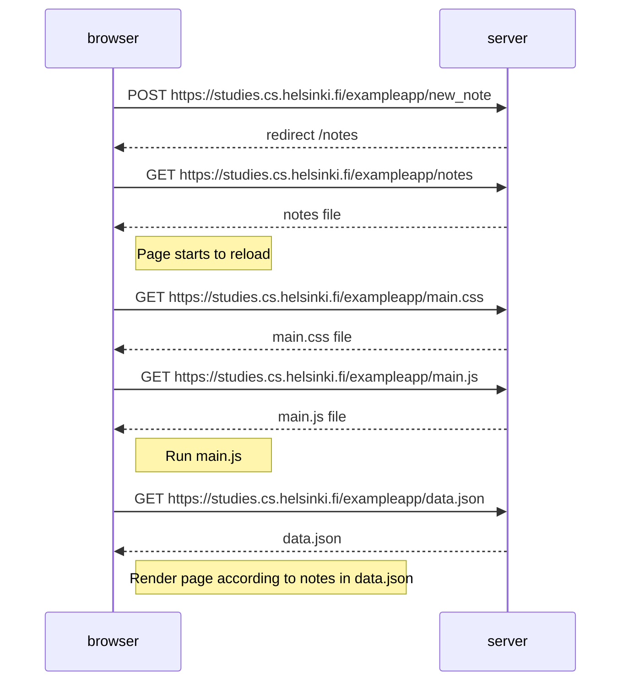

```mermaid
    sequenceDiagram
    participant browser
    participant server

    browser->>server: POST https://studies.cs.helsinki.fi/exampleapp/new_note
    server-->>browser: redirect /notes
    browser->>server: GET https://studies.cs.helsinki.fi/exampleapp/notes
    server-->>browser: notes file

    Note right of browser: Page starts to reload

    browser->>server: GET https://studies.cs.helsinki.fi/exampleapp/main.css
    server-->>browser: main.css file
    browser->>server: GET https://studies.cs.helsinki.fi/exampleapp/main.js
    server-->>browser: main.js file

    Note right of browser: Run main.js

    browser->>server: GET https://studies.cs.helsinki.fi/exampleapp/data.json
    server-->>browser: data.json
    Note right of browser: Render page according to notes in data.json

```
