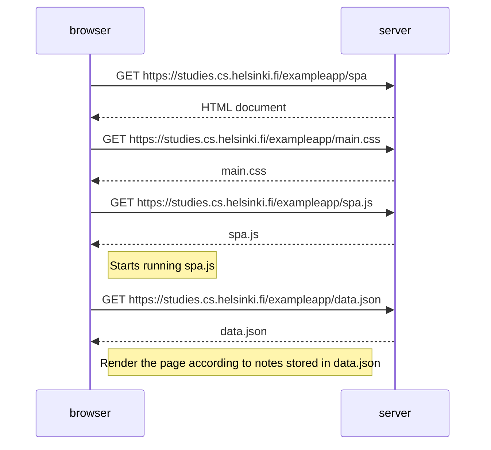

```mermaid
    sequenceDiagram
        participant browser
        participant server

        browser->>server: GET https://studies.cs.helsinki.fi/exampleapp/spa
        server-->>browser: HTML document
        browser->>server: GET https://studies.cs.helsinki.fi/exampleapp/main.css
        server-->>browser: main.css
        browser->>server: GET https://studies.cs.helsinki.fi/exampleapp/spa.js
        server-->>browser: spa.js
        Note right of browser: Starts running spa.js
        browser->>server: GET https://studies.cs.helsinki.fi/exampleapp/data.json
        server-->>browser: data.json
        Note right of browser: Render the page according to notes stored in data.json


```
